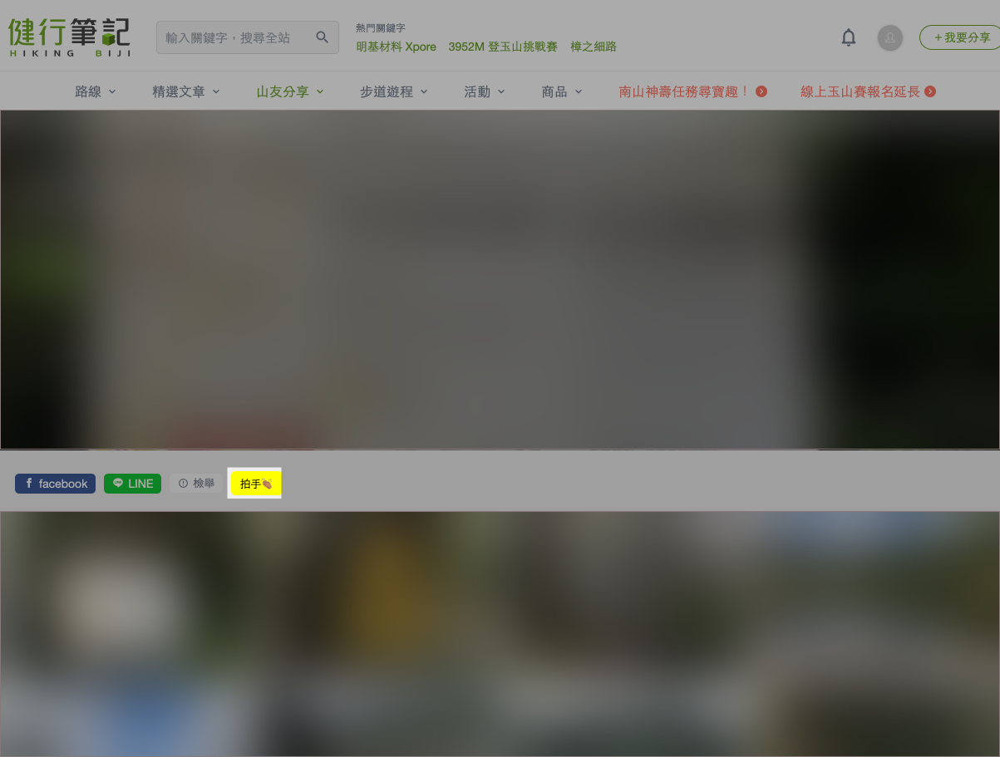

# hikingbiji

## Motivation

I always see my mom using her phone and also dozing off at the midnight :( \
I find out the reason why she does not go to bed is that \
she is always manually clicking "clap" button on her hiking.biji album photos one by one, \
in order to gain more popularity. \
As a software engineer, I decided to help her do this work and let her go to bed earlier.

## [Solution v1](./README_v1.md)

I implemented a program written in Go and compile it into Windows executable file. \
The program needs users to input album ID and cookies, which represent the user identity. \
However, opening developer tool to copy cookie values and extracting album ID from address bar \
are not easy for the olders.
Hence, solution v2 comes out.

## Solution v2

A Google Chrome extension. \
After installation, everytime accessing to a hikingbiji album, there will be an injected button "拍手👏🏽" showing up.

Click the button and it will automatically clap all photos in the album.

## How to Install

- Open extension management page by navigating to
  - <chrome://extensions> on Google Chrome
  - <edge://extensions> on Microsoft Edge
- Enable Developer Mode by clicking the toggle switch next to Developer mode
- Click the `Load unpacked` button and select the extension directory

---

## Disclaimer

This project is neither for commercial use nor melicious attack. \
If causing you any inconvinience, please contact me as soon as possible.
